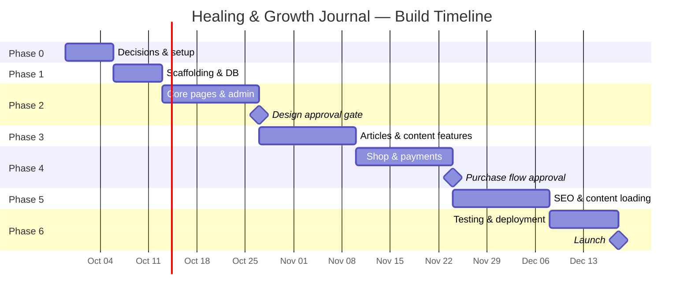

# The Healing and Growth Journal — Implementation Plan

> **Stack:** Next.js · Tailwind CSS · PostgreSQL · Prisma · NextAuth.js · Paystack · Vercel
> **Estimated effort:** 250–350 hours · **Calendar:** ~12 weeks at 25 hrs/week
> **Developer:** You (solo) · **Client:** Glory

---

## Phase 0 — Pre-Build Decisions & Setup *(Week 1 — ~15 hrs)*

Before writing a line of code, close the open questions that will block you later.

### 0.1 Decisions to settle with Glory

| # | Decision | Status | Resolution |
|---|----------|--------|------------|
| 1 | **Brand colors & Design theme** | ✅ Confirmed | **Dark brown + green** on warm cream background with a sophisticated, timeless **editorial design** aesthetic |
| 2 | **Resources page** | ✅ Confirmed | **Removed from v1** — excluded from navigation & routing for now |
| 3 | **Free downloads** | ✅ Deferred | v1 ships without email-gated downloads |
| 4 | **Product count & prices** | ⏳ Pending | PDFs not ready — build shop with realistic editorial mock data, real PDFs loaded later |
| 5 | **Home vs Start Here pathways** | ✅ Confirmed | Use 6 pathways everywhere (Start Here page version) |
| 6 | **Substack URL & social platforms** | ⏳ Pending | Glory will provide later — use placeholder config |
| 7 | **Domain & Deployment** | ⏳ Deferred | Local development only for now — no Vercel/domain needed immediately |

### 0.2 Accounts & services to set up

- [ ] **Domain** — register in Glory's name (Namecheap, Cloudflare, or Google Domains)
- [ ] **Vercel** — create account under Glory's email, add you as team member
- [ ] **Database** — provision a managed Postgres instance (Neon free tier to start)
- [ ] **Paystack** — Glory creates a business account (Nigeria); share test keys with you
- [ ] **Google Analytics** — create GA4 property
- [ ] **Google Search Console** — set up, verify later at deployment
- [ ] **Cloudflare R2 / AWS S3** — for product file storage and image uploads
- [ ] **Transactional email** — sign up for Resend (free tier covers early volume)
- [ ] **Git repo** — create private repo (GitHub); set up branch strategy (`main` → prod, `dev` → staging)

### 0.3 Content collection from Glory

- [ ] Founder photo + bio text
- [ ] About page story (already partly written in the brief)
- [ ] Substack URL
- [ ] Social media links
- [ ] Initial article list — which Substack posts to migrate
- [ ] Start Here pathway curation — which articles go under each pathway
- [ ] At least 1 finished product PDF + description + price
- [ ] Any logo or brand mark she has (even rough)

**Phase 0 deliverable:** A shared checklist (Google Doc or Notion) with every decision recorded and every asset either collected or given a delivery date.

---

## Phase 1 — Project Scaffolding & Database *(Week 1–2 — ~30 hrs)*

### 1.1 Next.js project setup *(~8 hrs)*

```
Tasks:
├── Initialize Next.js 14+ (App Router) with TypeScript
├── Install and configure Tailwind CSS
├── Set up project structure:
│   ├── /app           — routes (public site + admin)
│   ├── /components    — shared UI components
│   ├── /lib           — utilities, db client, auth config
│   ├── /types         — TypeScript types
│   └── /public        — static assets
├── Configure ESLint, Prettier
├── Set up environment variables (.env.local / .env.example)
├── Create a basic layout shell (header, footer, main)
└── Deploy to Vercel to confirm the pipeline works
```

### 1.2 Design system & tokens *(~10 hrs)*

```
Tasks:
├── Define color palette in Tailwind config:
│   ├── Primary: dark green
│   ├── Secondary: brown / warm earth
│   ├── Background: warm cream / off-white
│   ├── Accent: TBD with Glory (muted gold or soft orange)
│   └── Neutrals: grays for text, borders, muted elements
├── Select & load typography:
│   ├── Heading font — editorial serif (e.g. Playfair Display, Lora, or Fraunces)
│   └── Body font — clean readable sans or serif (e.g. Inter, Source Serif 4)
├── Define spacing scale, border radii (soft/rounded), shadows
├── Build foundational components:
│   ├── Button (primary, secondary, ghost, CTA)
│   ├── Card (article card, product card)
│   ├── Section wrapper (cream, green-tint, white variants)
│   ├── Badge / Tag
│   ├── Input, Textarea, Form wrapper
│   └── Navigation (desktop + mobile menu)
└── Build responsive header + footer per brief specs
```

### 1.3 Database schema & Prisma setup *(~12 hrs)*

```
Tasks:
├── Install Prisma, connect to Neon/Supabase Postgres
├── Design and write schema:
│
│   Core content:
│   ├── Article (title, slug, excerpt, body, featuredImage, publishedAt,
│   │           status, isSundayLove, seoTitle, seoDescription, ogImage)
│   ├── Category (name, slug, description)  — Healing, Growth, Relationships, Reflection
│   ├── Tag (name, slug)
│   ├── ArticleCategory (M:N join)
│   ├── ArticleTag (M:N join)
│   ├── Series (name, slug, description)  — Sunday Love Series, etc.
│   ├── ArticleSeries (M:N join with order field)
│   │
│   SEO & Pathways:
│   ├── SeoPage (title, slug, body, seoTitle, seoDescription, relatedArticles, relatedProducts)
│   ├── Pathway (name, slug, description, icon/image, displayOrder)
│   ├── PathwayItem (pathwayId, articleId, order, blurb)
│   │
│   Shop:
│   ├── Product (name, slug, description, whoItsFor, whatsIncluded,
│   │           price, currency, fileUrl, mockupImages, status)
│   ├── Order (userId, status, totalAmount, currency, paystackRef, createdAt)
│   ├── OrderItem (orderId, productId, price)
│   ├── Download (orderId, productId, downloadUrl, expiresAt, downloadCount)
│   │
│   Users & Auth:
│   ├── User (email, name, hashedPassword, role: ADMIN | CUSTOMER, createdAt)
│   ├── Session, Account, VerificationToken (NextAuth tables)
│   │
│   Site:
│   ├── ContactSubmission (name, email, subject, message, createdAt, isRead)
│   ├── FeaturedItem (type: ARTICLE | PRODUCT, itemId, section, displayOrder)
│   └── SiteSettings (key, value)  — social links, Substack URL, about text, etc.
│
├── Run initial migration
├── Write seed script with sample data
└── Create db utility module (lib/db.ts)
```

**Phase 1 deliverable:** A deployed skeleton site on Vercel with styled header/footer, design tokens, and a connected database with the full schema. No pages yet — just the foundation.

---

## Phase 2 — Core Public Pages & Admin Shell *(Weeks 3–5 — ~65 hrs)*

### 2.1 Public pages — static/simple *(~25 hrs)*

Build in this order, since each one introduces components the next page reuses:

| Order | Page | Key components | Est. |
|-------|------|----------------|------|
| 1 | **Home** | Hero section, 4-pillar cards, featured articles (dynamic), Start Here preview, Substack CTA, shop preview, closing section | 8 hrs |
| 2 | **About** | Founder story (prose block), photo layout, quoted lines, purpose statement | 3 hrs |
| 3 | **Start Here** | Pathway cards → each expands to show 3–5 curated items with blurbs | 4 hrs |
| 4 | **Contact** | Form (name, email, subject, message) → API route → DB + email | 4 hrs |
| 5 | **Privacy / Terms / Refund** | Static markdown-rendered legal pages | 2 hrs |
| 6 | **404** | Branded error page with navigation | 1 hr |
| 7 | **Resources** | Curated links/items page (pending Glory's definition) | 3 hrs |

### 2.2 Admin dashboard — shell & article CRUD *(~25 hrs)*

```
Tasks:
├── Set up NextAuth.js:
│   ├── Credentials provider (email + password)
│   ├── Admin role check middleware
│   └── Protected /admin routes
│
├── Admin layout:
│   ├── Sidebar navigation (Articles, Products, Pathways, Orders, Settings, etc.)
│   ├── Dashboard home (basic stats: article count, product count, recent orders)
│   └── Responsive admin shell
│
├── Article CRUD:
│   ├── Article list page (search, filter by status/category, pagination)
│   ├── Article create/edit form:
│   │   ├── Tiptap rich-text editor (bold, italic, links, headings, images, blockquotes)
│   │   ├── Title, slug (auto-generated), excerpt
│   │   ├── Featured image upload (to R2/S3)
│   │   ├── Category and tag multi-select
│   │   ├── Series assignment
│   │   ├── SEO fields (meta title, description, OG image)
│   │   ├── Status (draft / published)
│   │   ├── "Is Sunday Love Series" toggle
│   │   └── Publish date picker
│   └── Article delete (soft delete / archive)
│
└── Image upload API route → Cloudflare R2 or S3
```

### 2.3 Admin — other CRUD screens *(~15 hrs)*

| Screen | Fields | Est. |
|--------|--------|------|
| **Categories** | Name, slug, description | 2 hrs |
| **Tags** | Name, slug | 1.5 hrs |
| **Pathways** (Start Here) | Name, slug, description, items (article picker + blurb + order) | 4 hrs |
| **SEO Pages** | Title, slug, body (Tiptap), SEO fields, related articles/products picker | 3 hrs |
| **Featured Items** | Section selector, item type, item picker, order | 2 hrs |
| **Contact Submissions** | List view, read/unread toggle, detail view | 1.5 hrs |
| **Site Settings** | Key-value editor for social links, Substack URL, etc. | 1 hr |

**Phase 2 deliverable:** All static pages live and styled. Admin dashboard working with full article management. Glory can start entering content.

> [!IMPORTANT]
> **Decision gate after Phase 2:** Show Glory the Home, About, and Start Here pages. Get design approval before building out the rest. Cap this at **one revision round**.

---

## Phase 3 — Article System & Content Features *(Weeks 5–7 — ~40 hrs)*

### 3.1 Journal / Articles archive *(~12 hrs)*

```
Tasks:
├── Article archive page (/journal):
│   ├── Grid/list layout with article cards (image, title, excerpt, category, date)
│   ├── Filter sidebar/bar:
│   │   ├── Category filter (Healing, Growth, Relationships, Reflection)
│   │   ├── Tag filter
│   │   └── Search input (Postgres full-text search via Prisma)
│   ├── Pagination or infinite scroll
│   └── "No results" state
│
├── API routes:
│   ├── GET /api/articles — with query params for filters, search, pagination
│   └── Implement Postgres full-text search (ts_vector / ts_query)
│
└── Client-side filter state management (URL query params for shareable filtered views)
```

### 3.2 Single article page *(~10 hrs)*

```
Tasks:
├── Article template (/journal/[slug]):
│   ├── Title, featured image (responsive, optimized via next/image)
│   ├── Category badges, publication date
│   ├── Rich body content (rendered from Tiptap JSON/HTML)
│   ├── Reading time estimate
│   ├── "Related articles" section (same category, max 3)
│   ├── Substack CTA block ("Enjoyed this? Subscribe on Substack")
│   ├── Optional product CTA (if linked to a product)
│   ├── Social sharing buttons (copy link, Twitter/X, Facebook, WhatsApp)
│   └── Previous / Next article navigation
│
├── Schema.org Article structured data (JSON-LD)
├── Open Graph + Twitter Card meta tags
└── Canonical URL handling
```

### 3.3 Sunday Love Series *(~6 hrs)*

```
Tasks:
├── Standalone landing page (/sunday-love-series):
│   ├── Series description and visual treatment (distinct but on-brand)
│   ├── List of all Sunday Love articles (filtered automatically)
│   └── Unique card styling or accent to make the series recognizable
│
└── Visual treatment:
    ├── Subtle design differentiation (different accent color? decorative element?)
    └── "Sunday Love Series" badge on article cards site-wide
```

### 3.4 SEO / Prompt Library *(~12 hrs)*

```
Tasks:
├── Hub page (/prompts):
│   ├── Introduction section
│   ├── Grid of all 10 SEO pages with title, short description, and link
│   └── Internal links to related articles and products
│
├── Individual SEO page template (/prompts/[slug]):
│   ├── Long-form content (rendered from Tiptap)
│   ├── Embedded journal prompts
│   ├── Related articles sidebar/section
│   ├── Related products CTA
│   ├── Substack CTA
│   ├── Schema.org structured data
│   └── SEO metadata
│
├── Admin: SEO page CRUD (already built in Phase 2)
└── Create all 10 pages once Glory delivers the copy
```

**Phase 3 deliverable:** The full editorial system is live — archive with search/filter, article pages with SEO and social sharing, Sunday Love Series, and the SEO prompt library structure.

---

## Phase 4 — Shop, Payments & Customer Accounts *(Weeks 7–9 — ~55 hrs)*

### 4.1 Customer authentication *(~10 hrs)*

```
Tasks:
├── Registration page (/register):
│   ├── Name, email, password
│   ├── Email verification flow (via Resend)
│   └── Redirect to account dashboard after verification
│
├── Login page (/login):
│   ├── Email + password
│   ├── "Forgot password" flow
│   └── Remember me
│
├── Account dashboard (/account):
│   ├── Profile (name, email, password change)
│   ├── Order history
│   ├── Download links for purchased products
│   └── Logout
│
├── NextAuth.js config:
│   ├── Credentials provider for customers
│   ├── Role-based middleware (ADMIN vs CUSTOMER)
│   └── Session management
│
└── Password reset API route + email template
```

### 4.2 Shop pages *(~12 hrs)*

```
Tasks:
├── Shop page (/shop):
│   ├── Product grid with cards (mockup image, name, short desc, price, "View" button)
│   ├── Category/filter if product count warrants it
│   └── Empty state
│
├── Product detail page (/shop/[slug]):
│   ├── Product name, description, "who it's for", "what's included"
│   ├── Mockup images (gallery/carousel)
│   ├── Price display (₦ formatting)
│   ├── "Buy Now" / "Add to Cart" button
│   ├── Delivery information section
│   ├── Related products
│   ├── Schema.org Product structured data
│   └── SEO metadata
│
└── Admin: Product CRUD:
    ├── Product form (name, slug, description fields, price, currency)
    ├── Mockup image upload
    ├── Product file upload (PDF → R2/S3)
    └── Status toggle (draft/published)
```

### 4.3 Cart & checkout *(~15 hrs)*

```
Tasks:
├── Cart:
│   ├── Cart state (React context or Zustand — persisted to localStorage)
│   ├── Cart page (/cart) — items, quantities, remove, subtotal
│   ├── Cart icon with count in header
│   └── "Proceed to Checkout" button (requires login)
│
├── Checkout page (/checkout):
│   ├── Order summary
│   ├── Login prompt if not authenticated
│   ├── Paystack inline payment integration:
│   │   ├── Initialize transaction via API route → Paystack API
│   │   ├── Paystack inline popup for card payment
│   │   └── Verify transaction server-side on callback
│   └── Loading / processing states
│
├── API routes:
│   ├── POST /api/checkout — create order, initialize Paystack transaction
│   ├── POST /api/paystack/webhook — verify payment, update order status
│   └── GET /api/checkout/verify — verify transaction on redirect
│
└── Order confirmation page:
    ├── "Payment successful" message
    ├── Order details
    └── Download links
```

### 4.4 Digital delivery *(~8 hrs)*

```
Tasks:
├── Signed download URLs:
│   ├── Generate time-limited signed URLs for R2/S3 files
│   ├── Track download count per order item
│   └── Expire links after configurable period (e.g. 30 days / 5 downloads)
│
├── Download page (/account/downloads):
│   ├── List of purchased products with download buttons
│   └── "Link expired" state with re-request option
│
├── Order confirmation email (via Resend):
│   ├── Order summary
│   ├── Download links
│   └── Support contact
│
└── Admin: Orders screen:
    ├── Order list (status, customer, amount, date)
    ├── Order detail (items, payment status, Paystack ref)
    └── Manual status update if needed
```

### 4.5 Paystack integration testing *(~10 hrs)*

```
Tasks:
├── Test mode end-to-end:
│   ├── Successful payment flow
│   ├── Failed payment handling
│   ├── Webhook delivery and verification
│   └── Edge cases (duplicate payments, abandoned carts)
│
├── Currency handling:
│   ├── Confirm NGN as primary currency
│   ├── Price display formatting (₦1,500.00)
│   └── Paystack amount conversion (kobo)
│
└── Error handling and user messaging
```

**Phase 4 deliverable:** Complete e-commerce flow — browse products, add to cart, pay with Paystack, receive confirmation email, download digital files from account dashboard.

> [!IMPORTANT]
> **Decision gate after Phase 4:** Test the full purchase flow with Glory using Paystack test mode. Confirm it works before loading real products.

---

## Phase 5 — SEO, Integrations & Content Loading *(Weeks 9–11 — ~35 hrs)*

### 5.1 SEO implementation *(~10 hrs)*

```
Tasks:
├── Metadata:
│   ├── Dynamic meta titles and descriptions for all page types
│   ├── Open Graph tags (title, description, image, type)
│   ├── Twitter Card tags
│   └── Canonical URLs (website is canonical, not Substack)
│
├── Structured data (JSON-LD):
│   ├── Organization (site-wide)
│   ├── Article (on article pages)
│   ├── Product (on product pages)
│   └── BreadcrumbList (on inner pages)
│
├── Technical:
│   ├── Generated sitemap.xml (next-sitemap or custom)
│   ├── robots.txt
│   ├── Clean URL structure (no trailing slashes, lowercase)
│   └── 301 redirects if needed
│
├── Internal linking:
│   ├── Related articles on every article page
│   ├── SEO pages ↔ articles ↔ products cross-linking
│   └── Breadcrumb navigation
│
└── Analytics:
    ├── GA4 script integration (with cookie consent if needed)
    └── Google Search Console verification
```

### 5.2 Substack integration *(~5 hrs)*

```
Tasks:
├── Substack CTA component (reusable):
│   ├── "Subscribe on Substack" button → external link
│   ├── Variant for article pages (inline, contextual)
│   └── Variant for Home page (section block)
│
├── Substack feed (optional enhancement):
│   ├── Fetch latest posts via RSS (/feed endpoint)
│   ├── Cache and display on Home page
│   └── Fallback if RSS unavailable
│
└── One-time content migration:
    ├── Manually copy selected Substack posts into the CMS
    ├── Set canonical URL to website version
    └── Document the process for Glory to do future syncs
```

### 5.3 Email & spam protection *(~5 hrs)*

```
Tasks:
├── Contact form:
│   ├── Honeypot field (anti-spam)
│   ├── Rate limiting on API route
│   ├── Send notification email to Glory via Resend
│   └── Auto-reply to submitter
│
├── Order emails:
│   ├── Order confirmation template
│   ├── Download-ready template
│   └── Email verification template
│
└── Email templates: clean, branded HTML templates via React Email
```

### 5.4 Content loading *(~15 hrs)*

```
Tasks:
├── Articles:
│   ├── Migrate 15–20 articles from Substack
│   ├── Format, add featured images, assign categories/tags
│   ├── Write alt text for all images
│   └── Set up related article links
│
├── Start Here pathways:
│   ├── Create 6 pathways with curated articles
│   └── Write "why this is relevant" blurbs (with Glory)
│
├── SEO pages:
│   ├── Load Glory's 10 written pages
│   ├── Add related article/product links
│   └── SEO metadata for each
│
├── Products:
│   ├── Upload product files and mockup images
│   ├── Write descriptions (with Glory)
│   └── Set prices
│
├── Site settings:
│   ├── Social links, Substack URL
│   ├── Footer content
│   └── About page content finalization
│
└── Legal pages:
    ├── Privacy Policy
    ├── Terms and Conditions
    └── Refund Policy
```

**Phase 5 deliverable:** Fully SEO-optimized site with all content loaded, Substack integrated, emails working, and analytics tracking.

---

## Phase 6 — Testing, Deployment & Handover *(Weeks 11–12 — ~30 hrs)*

### 6.1 Testing *(~15 hrs)*

```
Tasks:
├── Cross-device testing:
│   ├── Mobile (iOS Safari, Android Chrome)
│   ├── Tablet
│   ├── Desktop (Chrome, Firefox, Safari, Edge)
│   └── Responsive breakpoint verification
│
├── Functional testing:
│   ├── All navigation links work
│   ├── Search and filter work correctly
│   ├── Contact form submits and emails deliver
│   ├── Full purchase flow (cart → checkout → payment → download)
│   ├── Customer registration, login, password reset
│   ├── Admin CRUD for all content types
│   └── Image uploads work
│
├── Performance:
│   ├── Core Web Vitals audit (Lighthouse)
│   ├── Image optimization check (next/image, WebP)
│   ├── Bundle size analysis
│   └── Target: all green on mobile
│
├── Accessibility:
│   ├── Keyboard navigation
│   ├── Screen reader testing (headings, alt text, ARIA)
│   ├── Color contrast check (WCAG 2.2 AA)
│   ├── Focus indicators
│   └── Form labels and error messages
│
├── Security:
│   ├── Auth flow edge cases
│   ├── Admin route protection
│   ├── SQL injection (Prisma handles this, but verify)
│   ├── XSS in rich-text content
│   ├── Download URL signing verification
│   ├── Rate limiting on all public API routes
│   └── HTTPS enforced
│
└── SEO verification:
    ├── All pages have unique titles and descriptions
    ├── Sitemap.xml is valid and complete
    ├── robots.txt is correct
    ├── Structured data validates (Google Rich Results Test)
    ├── Canonical URLs are correct
    └── No broken links
```

### 6.2 Production deployment *(~5 hrs)*

```
Tasks:
├── DNS:
│   ├── Point domain to Vercel
│   ├── SSL auto-provisioned
│   └── www → apex redirect (or vice versa)
│
├── Environment:
│   ├── Production environment variables in Vercel
│   ├── Production database (Neon/Supabase paid plan if needed)
│   ├── Paystack live keys (switch from test mode)
│   └── Resend production API key
│
├── Final checks:
│   ├── One live test purchase (real payment, refund after)
│   ├── Analytics receiving data
│   ├── Search Console sitemap submitted
│   ├── Robots.txt not blocking crawlers
│   └── All images and downloads load from production URLs
│
└── Backup:
    ├── Database backup schedule confirmed
    └── Git repo is clean, tagged with v1.0
```

### 6.3 Handover & training *(~10 hrs)*

```
Tasks:
├── Admin training with Glory:
│   ├── How to create/edit/publish articles
│   ├── How to add products and set prices
│   ├── How to manage Start Here pathways
│   ├── How to update site settings (social links, etc.)
│   ├── How to view orders and contact submissions
│   └── How to update legal pages
│
├── Handover document:
│   ├── Account credentials and access (Vercel, database, Paystack, Resend, R2/S3, domain, analytics)
│   ├── How the site is structured (architecture overview)
│   ├── How to deploy changes (Git workflow)
│   ├── Hosting costs and who pays what
│   ├── What to do if something breaks
│   └── Recommended ongoing tasks (backups, updates)
│
└── Post-launch monitoring:
    ├── Monitor for errors (Vercel logs) for first 2 weeks
    ├── Check Core Web Vitals after indexing
    └── Fix any launch bugs
```

**Phase 6 deliverable:** Live production website on Glory's domain. Handover document delivered. Glory trained on admin.

---

## Visual Timeline



---

## Hours Summary

| Phase | Focus | Hours |
|-------|-------|-------|
| 0 | Pre-build decisions & setup | ~15 |
| 1 | Scaffolding & database | ~30 |
| 2 | Core pages & admin CMS | ~65 |
| 3 | Articles & content features | ~40 |
| 4 | Shop, payments & accounts | ~55 |
| 5 | SEO, integrations & content | ~35 |
| 6 | Testing, deployment & handover | ~30 |
| | **Total** | **~270 hrs** |

> [!NOTE]
> This estimate is higher than the brief's 215–330 range because it accounts for building a custom CMS and auth system from scratch in Next.js, rather than using WordPress. The original estimate assumed a more conventional stack.

---

## Risk Mitigations

| Risk | Mitigation |
|------|------------|
| Glory delays content delivery | Don't block code work — use placeholder content, but gate content-loading (Phase 5) on her delivery |
| Scope creep on design | One design review after Phase 2, one revision round, then final. Agree upfront. |
| Paystack integration issues | Start with test mode early (Phase 4); don't leave payment work to the end |
| SEO page writing delays | The 10 SEO page *templates* ship in Phase 3. Content loads whenever Glory delivers them — doesn't block launch |
| Legal page liability | You're writing them yourself — use clear "not legal advice" templates. Recommend Glory get a real review eventually |
| Custom CMS takes too long | If admin CRUD becomes a time sink, fall back to a headless CMS (Payload or Sanity) for content management |

---

## What to Do Right Now

1. **Send Glory the Phase 0 checklist** — get answers on brand colors, Resources page, domain name, and product readiness
2. **Set up accounts** — domain, Vercel, database, Paystack, Git repo
3. **Start Phase 1** — scaffold the Next.js project, set up design tokens, and build the database schema

> [!TIP]
> You can start Phase 1 in parallel with waiting for Glory's Phase 0 answers. The scaffolding and database design don't depend on her responses.
